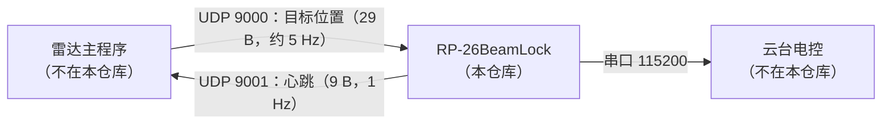

# RP-26BeamLock｜RoboMaster 雷达云台激光反制

`RP-26BeamLock` 是深圳大学 RobotPilots 战队 2026 赛季雷达系统的云台分系统：接收雷达主程序通过 UDP
发来的敌方无人机坐标，用相机做视觉伺服，把激光指向对方无人机上的激光检测装置并持续照射完成反制；
支持目标扫描、丢失重捕、命中判定与激光偏置的动态标定。

- 语言/构建：C++20 + CMake
- 目标平台：Ubuntu（x86_64），上赛季部署在 NUC12 上
- 许可证：[MIT](LICENSE)

> [!IMPORTANT]
> **开源边界：** 本仓库只包含云台分系统；雷达主程序与云台电控固件均不在本仓库内。
> 两者之间的接口约定见 [`docs/PROTOCOL.md`](docs/PROTOCOL.md)，没有雷达主程序时可用自带的模拟器联调（见下文）。

## 系统概览



| 链路 | 方向 | 内容 | 频率 |
| --- | --- | --- | --- |
| 目标位置 | 雷达主程序 → RP-26BeamLock | UDP 9000，`NetworkPack` 29 B（见 [`docs/PROTOCOL.md`](docs/PROTOCOL.md)） | 约 5 Hz |
| 心跳/状态 | RP-26BeamLock → 雷达主程序 | UDP 9001，9 B（含当前状态） | 1 Hz |
| 云台控制 | RP-26BeamLock ↔ 云台电控 | 串口 `/dev/ttyACM0` @ 115200 | 下发约 1 kHz，反馈由电控决定 |

- 地址在 `config.yaml` 的 `NetworkConfig` 中配置，示例配置用 `127.0.0.1` 占位。
- 完整数据流：UDP 收到目标坐标 → 相机检测目标与激光点 → PID 视觉伺服算出云台角速度 → 串口下发云台角；
  同时把状态通过 UDP 心跳上报给雷达主程序，并可选地把图像/日志写入 Foxglove 与 mcap。

## 硬件

| 部件 | 现役型号 | 说明 |
| --- | --- | --- |
| 相机 | 海康 MV-CS016-10UC（USB3） | 运行需安装海康 MVS SDK（编译验证可用 `-DUSE_FAKE_MVS=ON`） |
| 镜头 | 50 mm 定焦 | 视场很小，场上捕获目标依赖雷达引导或自己扫描 |
| 计算单元 | NUC12 | Ubuntu 24.04LTS |
| 云台 | 二轴云台 + 电控固件 | 通过串口接收目标角度、回传角度与编码器 |
| 串口 | `/dev/ttyACM0` @ 115200 | 可在 `config.yaml` 中修改，或用 socat 虚拟串口 |

## 依赖

- CMake ≥ 3.10、支持 C++20 的编译器
- OpenCV、Eigen3、yaml-cpp、Boost（Asio/Beast）
- **海康 MVS SDK**：闭源，需自行从海康机器人官网下载安装（默认路径 `/opt/MVS`，可用 `-DMVS_ROOT=<路径>` 指定）。
  本仓库不包含也不得再分发该 SDK。
  只想验证编译、手头没有 MVS 时，可用 `-DUSE_FAKE_MVS=ON` 走仓库内置的空实现替身。
- Foxglove SDK：构建时自动从官方 Release 下载（MIT）。国内网络受限时可用
  `-DFOXGLOVE_DOWNLOAD_URL=<镜像地址>` 覆盖。
- 仅 `Tools/Export` 需要 Protocol Buffers 与 mcap（构建时自动拉取）。

Ubuntu 上可用：

```bash
sudo apt install build-essential cmake libopencv-dev libeigen3-dev libyaml-cpp-dev libboost-all-dev \
                 protobuf-compiler libprotobuf-dev
```

## 构建

```bash
cmake -S . -B build -DCMAKE_BUILD_TYPE=Release
cmake --build build -j
```

常用构建选项：

| 选项 | 默认 | 作用 |
| --- | --- | --- |
| `CV_SHOW` | OFF | 打开 OpenCV 窗口显示（会显著降低控制帧率，仅调试用） |
| `SAVE_MCAP` | ON | 是否把图像/日志写入 `mcaps/*.mcap` |
| `USE_FAKE_FOXGLOVE` | OFF | 用命令行日志替代 Foxglove SDK，构建时不再下载 SDK |
| `MVS_ROOT` | `/opt/MVS` | 海康 MVS SDK 安装路径 |
| `USE_FAKE_MVS` | OFF | 用仓库内置的假 MVS SDK（`Detect/MVSCamera/fake-sdk/`）做编译验证，无需安装 MVS |
| `FOXGLOVE_DOWNLOAD_URL` | 官方 Release | Foxglove SDK 下载地址（可换镜像） |

### 无 MVS SDK 时的编译验证

手头没有海康 MVS SDK（或只想确认代码能编过）时，用内置的假 SDK：

```bash
cmake -S . -B build -DCMAKE_BUILD_TYPE=Release -DUSE_FAKE_MVS=ON
cmake --build build -j
```

假 SDK 位于 `Detect/MVSCamera/fake-sdk/`，只提供 `MVSCamera` 用到的那些类型与接口的**空实现**，
用来跑通编译与链接，不模拟相机行为：运行时会打印 `No cameras found!`。

> 假 SDK 的结构体布局按官方字段顺序书写但未做完整复刻，只在与假 SDK 一起编译时自洽。
> 装上真实 MVS SDK 后请**全量重新编译**（`-DUSE_FAKE_MVS=OFF`），不要复用 `USE_FAKE_MVS=ON` 的构建产物。
> 假 SDK 产出的是静态库，不会生成 `libMvCameraControl.so`，以免被误当作真 SDK 安装。

## 运行

```bash
./build/App/beamlock                 # 默认逐行扫描
./build/App/beamlock --scan-mode square --no-image-log
```

| 参数 | 说明 |
| --- | --- |
| `--scan-mode line\|square` | 扫描模式：`line` 逐行绝对角度扫描；`square` 以雷达给出的位置为中心方形扫描（默认 `line`） |
| `--no-image-log` | 不把相机图像写入 Foxglove/mcap（可提高帧率） |

程序启动时会在当前目录寻找 `config.yaml`，找不到就用默认值自动生成一份（默认值中的标定参数是**占位值**，
必须重新标定，见 [`docs/calibration.md`](docs/calibration.md)）。也可以直接复制 [`config.example.yaml`](config.example.yaml)。

可视化：程序内置 Foxglove WebSocket 服务（`ws://<设备IP>:8765`），用 [Foxglove](https://foxglove.dev/) 连上后
导入 `FoxGlove/layout.json` 即可看到图像、目标标注、激光点、云台角度与网络包。

### 没有硬件时如何跑起来

| 缺什么 | 怎么办 |
| --- | --- |
| 雷达主程序 | 运行 `./build/Tools/NetworkTest/server_test`：向 `127.0.0.1:9000` 以 10 Hz 发送假目标，支持交互式修改 `x/y/z/allow_counter` |
| 云台电控 | 用 `socat` 造一对虚拟串口 + `./build/Tools/SerialTest/serial_simulate` 模拟电控回包，见 [`Tools/SerialTest/README.md`](Tools/SerialTest/README.md) |
| Foxglove SDK | 配置时加 `-DUSE_FAKE_FOXGLOVE=ON`，日志改为打印到终端 |
| 相机 | 没有图像来源：`-DUSE_FAKE_MVS=ON` 只能验证编译与链接，主程序仍会因枚举不到相机而打印 `No cameras found!` 后退出 |

## 工具

所有工具在 `build/Tools/<目录>/<目标名>` 下。序号对应 [`docs/calibration.md`](docs/calibration.md) 的标定步骤。

| 工具 | 用途 |
| --- | --- |
| `Tools/CameraTune/camera_tune` | 实时预览、在线调增益/曝光 |
| `Tools/CameraTune/camera_capture` | 采集图像（可驱动云台到指定编码器角） |
| `Tools/CameraTune/camera_calibration` | 相机内参标定 |
| `Tools/CameraTune/CaptureServer/capture_server` | 本地 HTTP 服务：远程改曝光/增益、拉取最新帧（默认只监听 127.0.0.1） |
| `Tools/LazerCalibration/lazer_calibration` | 由多距离激光照片拟合 `x_k/x_b/y_k/y_b` |
| `Tools/LazerCalibration/lazer_calibration_once` | 单张图片手动框选激光点，检查检测效果 |
| `Tools/LidarGuideCalibration/lidar_guide_calibration` | 解算雷达系→云台系外参 |
| `Tools/LidarGuideCalibration/lidar_guide_calibration_gen` | 生成合成标定数据，验证解算流程 |
| `Tools/LidarGuideCalibration/lidar_guide_encoder_monitor` | 监控云台编码器/角度 |
| `Tools/LidarGuideCalibration/lidar_guide_point_to_angle*` | 用标定结果把雷达点转成云台角（支持热重载、`--send` 直接驱动） |
| `Tools/NetworkTest/server_test` | 模拟雷达主程序发送目标位置 |
| `Tools/SerialTest/serial_test` | 串口调试：发角度、切模式、打印反馈 |
| `Tools/SerialTest/serial_simulate` | 模拟云台电控 |
| `Tools/DetectTest/detect_test` | 用图片/视频调试检测算法 |
| `Tools/DetectTest/target_detecter_test` | 检测算法单元测试式验证 |
| `Tools/GimbalControllerTest/gimbal_controller_test` | 轨迹规划与扫描策略测试 |
| `Tools/Export/export` | 把 mcap 录像导出为视频 |

## 配置

配置项含义、单位与默认值见 [`CONFIG.md`](CONFIG.md)，带注释的模板见 [`config.example.yaml`](config.example.yaml)。
主要分组：`CameraConfig`（相机内参/曝光）、`TripodHeadConfig`（云台标定与限位）、`ServoConfig`（PID 与扫描）、
`TrackStrategyConfig`（扫描策略与雷达引导外参）、`DetectConfig`（检测阈值）、`SerialConfig`、`NetworkConfig`。

> `TripodHeadConfig` 是**云台本体**（tripod head）的配置节名，与项目名无关，为兼容既有 `config.yaml` 保持不变。

## 标定

三步标定（相机内参 → 激光光路 → 雷达引导外参）与运行中的动态标定，详见 [`docs/calibration.md`](docs/calibration.md)。

调试时的经验：

- 尽量让激光在 15 m 距离上照到画面中心附近，可以先用 `camera_tune` 观察激光落点与画面中心的偏差。
- Foxglove 里绿色十字是程序认为的激光落点，红/黄圆圈是目标中心（红色表示判定为命中）。
- 标定可以在较暗的环境下进行，避免环境光干扰激光检测。

## 控制逻辑

程序初始化相机、云台控制器与通信模块（启动阶段会持续发送“回正”指令，把收到反馈时的角度记为 0 点），
然后进入主循环：

- **Tracking**：检测到目标后，用目标中心与预设激光点的像素误差做 PID（含前馈）视觉伺服，
  把角速度指令交给云台控制器；云台控制器再做速度/加速度限制与轨迹规划后下发串口。
- **Lost**：丢失目标后保持当前角度等待 `reset_time_threshold`（默认 5 s）。
- **Scanning**：仍找不到目标时按扫描模式运动 —— `line` 用绝对角度逐行扫描，`square` 以雷达给出的位置为中心方形扫描。
- 任何状态下，目标相对角超过 `max_pitch_angle` / `max_yaw_angle` 都会停止下发指令并转入扫描（基于编码器换算，避免陀螺仪零漂误判）。

**激光动态标定**：未命中时在预设激光点周围做同心圆扫描；当扫描扫过命中区域（miss→hit→miss 两个边沿）时，
取弦中点估计命中区域圆心，用卡尔曼滤波修正激光偏置；滤波器按距离分段（每 5 m 一段），跨段时继承上一段估计。

**反制开关**：雷达主程序会在数据包里给出 `allow_counter`，为 `false` 时云台仍正常跟踪，但把激光瞄准点下移 100 px，
即“跟着但不打”。

## 部署（开机自启）

`Tools/AutoStart/install_autostart.sh` 会（**需要 sudo，且会修改系统配置**）：

1. 修改 `/etc/gdm3/custom.conf` 开启自动登录（原文件备份为 `custom.conf.bak`）；
2. 生成 `<工作目录>/start.sh` 并安装 `autostart.service`（崩溃后自动重启）。

```bash
BEAMLOCK_USER=$USER BEAMLOCK_WORKDIR=$PWD/build ./Tools/AutoStart/install_autostart.sh
sudo systemctl start|stop|restart|status autostart.service
./Tools/AutoStart/remove_autostart.sh     # 还原并卸载
```

## 目录结构

- `App/`：主程序入口 `beamlock`、云台控制器与轨迹规划、扫描策略
- `Core/`：配置解析、时间工具、公共类型
- `Detect/`：海康相机封装 `MVSCamera`（含编译验证用的假 SDK `fake-sdk/`）、目标检测 `TargetDetecter`
- `Communication/`：UDP `Network`、串口 `Serial`、CRC `CRCCheck`
- `FoxGlove/`：Foxglove 服务封装（日志、图像、标注、mcap 录制）
- `Tools/`：标定与调试工具（见上表）
- `docs/`：协议与标定文档

看代码建议从 `App/src/Main.cpp` 的 `while` 主循环开始，前面都是初始化。

## 开发提示

- 控制帧率一般能到 130 FPS 以上；开启 OpenCV 可视化或 Foxglove 图像压缩会显著降低帧率
  （压缩会让图像写入与日志抢锁），需要高帧率时用 `--no-image-log` 或 `-DCV_SHOW=OFF`。
- 相机直出是 `BayerRG8` 单通道图像；转 `RGB8` 开销很大，若后续接入神经网络建议直接用 Bayer 格式，
  或以卷积后的 `color_feature` 作为输入。
- 修改检测算法时尽量保持 `Tools/DetectTest` 与 `TargetDetecter` 的逻辑一致，方便离线对比。
- 提交请保持原子化（一个提交只做一件事）。

## 未来计划

- 检测头换成神经网络，完成第三阶段的锁定（网络只需给出目标中心位置，精度要求不高）
- 调好雷达对云台的引导
- 检测头加入颜色判断，不再依赖限制角度来避免锁定己方
- 动态标定使用退火逻辑，逐渐减小尝试范围

## 协议

见 [`docs/PROTOCOL.md`](docs/PROTOCOL.md)：UDP 目标位置包、心跳包、串口收发帧与 CRC 参数。

## 许可证与致谢

本项目采用 [MIT 许可证](LICENSE)。第三方依赖及其许可证见 [`THIRD_PARTY_NOTICES.md`](THIRD_PARTY_NOTICES.md)。

## 应急处理

整套方案对标定精度要求不高。比赛中若发现异常（如相机对焦环松动、激光照不到），按以下顺序排查：

1. 关闭云台程序，接显示屏，运行 `camera_tune`；
2. 把光圈开到最大，看能否看清远处目标；不行就大胆调整焦距环对焦；
3. 检查激光落点是否与标定时一致，不一致就重新调整相机/激光的安装角度；
4. 关闭 `camera_tune`，把光圈拧到最小；
5. 打开 `config.yaml`，把 `ServoConfig/scan_max_radius` 调大到 40 以上，提高重新命中的概率；
6. 重启云台程序。

本套应急方案在激光器因撞击偏移出镜头视野，对焦环松动的情况下在2026南部区域赛环节成功恢复了二级难度锁定（可见南部赛区RPvs华南虎第一局重赛）

## 许可证

本项目自有代码采用 [MIT License](LICENSE)。仓库中包含的第三方代码和依赖遵循其各自的许可证（见 [THIRD_PARTY_NOTICES.md](THIRD_PARTY_NOTICES.md)）。
