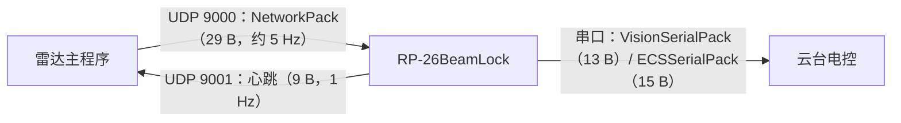

# 通信协议

本文档描述 RP-26BeamLock 与外部世界的两个接口：

1. **UDP（与雷达主程序）**：接收目标位置、上报自身状态；
2. **串口（与云台电控）**：下发目标角度、接收角度与编码器反馈。

> 两端的对端程序（雷达主程序、云台电控固件）不属于本仓库，因此这里是**唯一的接口约定**。
> 修改任一结构体都必须同步修改对端，并更新本文档。

## 1. 拓扑

- 地址在 `config.yaml` 的 `NetworkConfig` 中填写（见 `CONFIG.md`），示例配置用 `127.0.0.1` 占位。
- 本仓库监听 `NetworkConfig.listen_port`（默认 9000），向 `NetworkConfig.send_target_ip:send_target_port`（默认 `127.0.0.1:9001`）发送心跳。

## 2. UDP：雷达主程序 → 云台（目标位置）

- 传输：UDP，**裸结构体，无帧头、无 CRC、无长度字段**；小端。
- 结构体定义：`Core/include/CommonTypes.h` 的 `CommonTypes::NetworkPack`，`#pragma pack(push, 1)`，共 **29 字节**：

| 偏移 | 类型 | 字段 | 说明 |
| --- | --- | --- | --- |
| 0 | `uint32_t` | `frame_id` | 帧序号，单调递增；**当前云台端不校验**（乱序/重复检查已注释） |
| 4 | `double` | `x` | 目标在**雷达坐标系**下的 x，单位 **米** |
| 12 | `double` | `y` | 同上，y |
| 20 | `double` | `z` | 同上，z |
| 28 | `bool` | `allow_counter` | `true`＝允许反制；`false`＝允许跟踪但不反制 |

- 发送频率：约 5 Hz；云台端丢弃长度不等于 29 字节的包。
- **坐标系与单位**：`x/y/z` 是雷达主程序自身坐标系下的**米制坐标**，**不是云台角度**。云台使用 `TrackStrategyConfig.guide_translation` 与 `guide_rotation_euler_zyx_deg` 组成的 4×4 变换（见 `docs/calibration.md`）把该点转到云台角度。
- **约定与注意事项**：
  - `(0, 0, 0)` 约定为“无目标”；云台还会把模长不在 `(0, 40]` 米范围内的数据视为无效，回退到 15 m 估计并打印告警（`App/src/Main.cpp`）。
  - `allow_counter=false` 时，云台不改变跟踪逻辑，只把投影出的激光瞄准点在图像 y 方向下移 100 px（跟随但不反制）。

## 3. UDP：云台 → 雷达主程序（心跳/状态）

- 传输：UDP，1 Hz，**9 字节**，小端，`#pragma pack(push, 1)`（`Communication/Network/include/Network.h`）：

| 偏移 | 类型 | 字段 | 取值 |
| --- | --- | --- | --- |
| 0 | `uint8_t` | `SOF` | 保留，当前填 `0` |
| 1 | `uint16_t` | `data_length` | 保留，当前填 `0` |
| 3 | `uint8_t` | `seq` | 保留，当前填 `0` |
| 4 | `uint8_t` | `difficulty` | 保留，当前填 `0` |
| 5 | `uint16_t` | `cmd_id` | `0xFFFF`（心跳） |
| 7 | `uint8_t` | `device_id` | `0x01`＝本仓库（云台）；其他程序 id 由雷达主程序的注册表分配 |
| 8 | `uint8_t` | `status` | `0=Initializing, 1=Tracking, 2=Scanning, 3=Lost` |

- 雷达主程序侧超过 5 秒未收到心跳视为离线。

## 4. 串口：云台 ↔ 电控

- 物理层：`SerialConfig.port_name`（默认 `/dev/ttyACM0`），`SerialConfig.baud_rate`（默认 115200），8N1，无流控。
- 帧头 `SOF = 0xA5`；CRC16 校验；`#pragma pack(push, 1)`。
  （注意：历史上尝试用 `alignas(1)` 实现紧凑布局，在某些编译器上不生效，必须用 `#pragma pack`。）
- 若没有真实电控，可用 `Tools/SerialTest/serial_simulate` + `socat` 虚拟串口联调，见该目录的 README。

### 4.1 云台 → 电控：`VisionSerialPack`（13 字节）

| 偏移 | 类型 | 字段 | 说明 |
| --- | --- | --- | --- |
| 0 | `uint8_t` | `SOF` | `0xA5` |
| 1 | `float` | `pitch_target_angle` | 目标 pitch，度（陀螺仪角） |
| 5 | `float` | `yaw_target_angle` | 目标 yaw，度（陀螺仪角） |
| 9 | `bool` | `control` | 电机是否发力；`false`＝不发力（安全停机） |
| 10 | `uint8_t` | `control_mode` | `0=Reset`（回正）、`1=Gyroscope`（按陀螺仪角）、`2=Encoder`（按编码器角） |
| 11 | `uint16_t` | `CRC16` | 前 11 字节的 CRC，低字节在前 |

- 主程序用法：启动阶段以 `Reset` 模式持续发送，直到收到 `reset_pack_count`（默认 8192）个反馈包，把此时的角度与编码器读数记为 0 点；之后固定用 `Gyroscope` 模式；`Encoder` 模式目前由 `Tools/CameraTune` 的采集工具使用。
- 发送频率：控制线程约 1 kHz（上限由 `SerialConfig.max_send_frequency` 约束）。

### 4.2 电控 → 云台：`ECSSerialPack`（15 字节）

| 偏移 | 类型 | 字段 | 说明 |
| --- | --- | --- | --- |
| 0 | `uint8_t` | `SOF` | `0xA5` |
| 1 | `float` | `pitch_gyro_angle` | 陀螺仪 pitch，度 |
| 5 | `float` | `yaw_gyro_angle` | 陀螺仪 yaw，度（**存在零漂**，yaw 尤其明显） |
| 9 | `uint16_t` | `pitch_encoder_angle` | 编码器原始值 |
| 11 | `uint16_t` | `yaw_encoder_angle` | 编码器原始值 |
| 13 | `uint16_t` | `CRC16` | 前 13 字节的 CRC，低字节在前 |

- 编码器每圈计数由 `TripodHeadConfig.{yaw,pitch}_encoder_per_round` 给出（默认 8192）。
- 云台侧的**角度护栏基于编码器换算**（陀螺仪 yaw 漂移不可信）：目标相对角超过 `max_pitch_angle` / `max_yaw_angle` 时停止下发指令并转入扫描状态（`App/GimbalController/src/GimbalController.cpp`）。
- 解析：按 `SOF` 逐字节滑动，凑满 15 字节后校验 CRC；失败时只丢弃 1 字节继续寻找帧头。

### 4.3 CRC 参数

- CRC16：初值 `0xFFFF`，生成多项式 `0x1021`，**反射实现**（等价 CRC-16/MCRF4XX：refin=refout=true、xorout=0；`"123456789"` 的校验值为 `0x6F91`），**低字节在前**。
- CRC8（裁判系统用，本仓库仅用于与裁判系统相关的模块）：初值 `0xFF`，生成多项式 `x^8 + x^5 + x^4 + 1`。
- 实现与查表见 `Communication/Serial/CRCCheck/`，表的来源说明见 `THIRD_PARTY_NOTICES.md`。

## 5. 没有硬件时如何自测

1. **没有雷达主程序**：`./build/Tools/NetworkTest/server_test`
   向 `127.0.0.1:9000` 以 10 Hz 发送 `NetworkPack`，支持交互式修改 `x/y/z/allow_counter`；配合 Foxglove（`ws://<设备>:8765`）观察瞄准点。
2. **没有云台电控**：`Tools/SerialTest`（`socat` 虚拟串口 + `serial_simulate`）。
3. **没有相机**：未安装海康 MVS SDK 时可用 `-DUSE_FAKE_MVS=ON` 完成编译与链接验证（见 README「无 MVS SDK 时的编译验证」），
   但假 SDK 枚举不到设备，主程序会打印 `No cameras found!` 后退出，无法进入跟踪流程。
